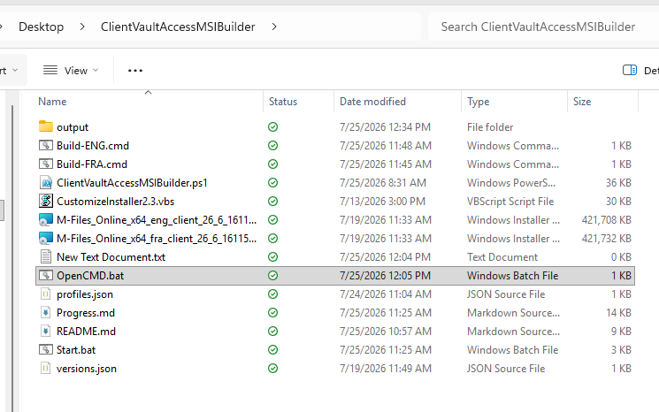
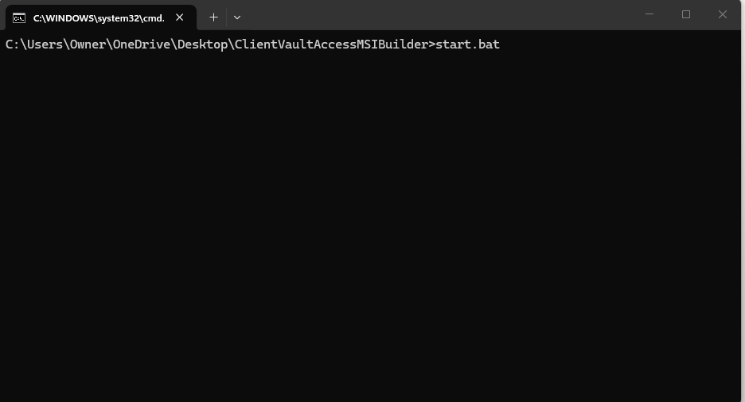
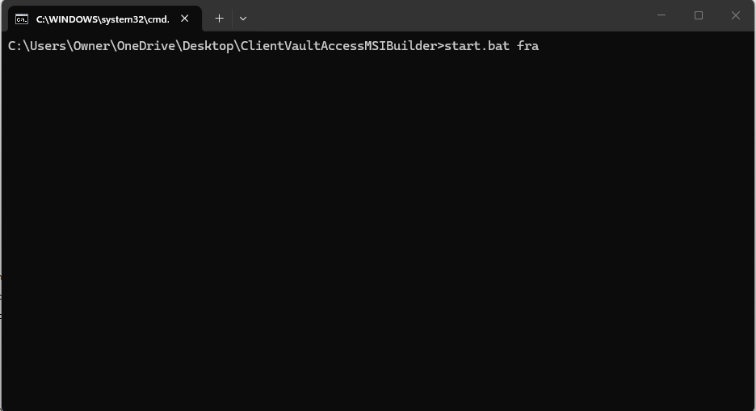
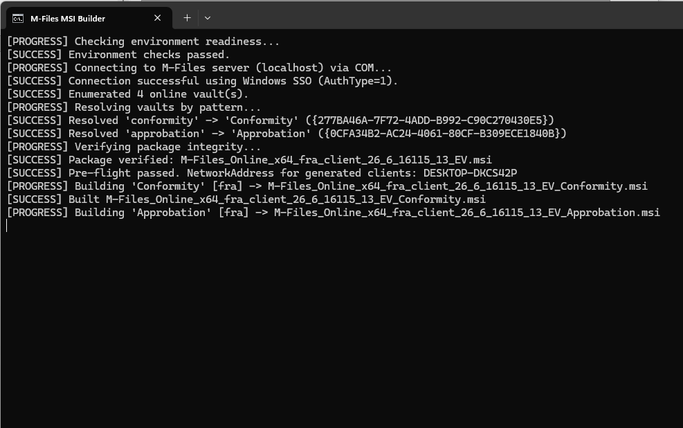

# ClientVaultAccessMSIBuilder — Runbook

Builds vault-configured M-Files client MSIs from live vault metadata. No manual GUIDs, no MSI editing.

> Run this on the target M-Files server. `start.bat` is the only entry point you need.

## Contents

- [Quick Start](#quick-start)
- [Visual Walkthrough](#visual-walkthrough)
- [How It Works](#how-it-works)
- [Architecture Decisions](#architecture-decisions)
- [Manual Step → Script Mapping](#manual-step--script-mapping)
- [Directory Layout](#directory-layout)
- [Server Address Override](#server-address-override)
- [Output Naming](#output-naming)
- [PowerShell Direct / Testing](#powershell-direct--testing)
- [Before the First Run](#before-the-first-run)
- [Troubleshooting](#troubleshooting)

## Quick Start

Run from inside the `ClientVaultAccessMSIBuilder` directory.

| Command | Result |
|---|---|
| `start.bat` | Menu (Enter = French), then builds all 3 MSIs |
| `start.bat fra` | No menu — 3 MSIs, French |
| `Build-FRA.cmd` | One-click shortcut — builds all 3 MSIs, French |
| `start.bat eng` | No menu — 3 MSIs, English |
| `Build-ENG.cmd` | One-click shortcut — builds all 3 MSIs, English |
| `OpenCMD.bat` | Opens a CMD window in the kit directory (Desktop, then OneDrive Desktop) |
| `start.bat approbation fra` | 1 MSI — Approbation Only, French |
| `start.bat conformity fra` | 1 MSI — Conformity Only, French |
| `start.bat approbation eng` | 1 MSI — Approbation Only, English |
| `start.bat conformity eng` | 1 MSI — Conformity Only, English |
| `start.bat both fra` | 1 MSI — Conformity + Approbation Both, French |
| `start.bat both eng` | 1 MSI — Conformity + Approbation Both, English |

Output lands in `output\` under the current kit folder.

## Visual Walkthrough

**Legend:** `[BAT]` batch file launcher · `[CMD]` command prompt window · `→` next action

**1.** `[BAT]` Main folder ready → confirm launchers are present (`OpenCMD.bat`, `Build-FRA.cmd`, `Build-ENG.cmd`, `start.bat`)



**2.** `[BAT]` Run `OpenCMD.bat` → auto-locates the project folder from Desktop or OneDrive Desktop



**3.** `[CMD]` Confirm working directory → the prompt path must end with `\ClientVaultAccessMSIBuilder>` before launching the build



**4.** `[CMD]` Run the full French batch to completion → `Build-FRA.cmd` (same as `start.bat fra`, builds the default 3 MSI profiles)



**Operator notes**

- The menu appears only when `start.bat` runs with no arguments.
- Use `Build-FRA.cmd`, `Build-ENG.cmd`, `start.bat fra`, or `start.bat eng` to bypass the menu.
- `OpenCMD.bat` checks `%USERPROFILE%\Desktop\ClientVaultAccessMSIBuilder` first, then `%USERPROFILE%\OneDrive\Desktop\ClientVaultAccessMSIBuilder`.

## How It Works

This application automates the full M-Files client MSI customization flow on the target M-Files server.

> **Note:** Configuration lives in external files — `profiles.json` and `versions.json` — not hardcoded in the script. Confirm both are updated with the correct `packageShare`, pinned version, and SHA-256 hashes for your environment before running.

| Stage | What happens |
|---|---|
| 1. Entry & arguments | `start.bat` launches PowerShell with `-ExecutionPolicy Bypass`; supports the zero-arg menu and the one/two-arg profile/language contract. |
| 2. Pre-flight validation | Verifies the `MFServer` service, required files, package share reachability, and `cscript.exe` presence. |
| 3. Live vault discovery | Connects to M-Files COM (`localhost`), enumerates online vaults, resolves in-scope vaults by configured pattern. |
| 4. Package integrity gate | Reads the pinned version from `versions.json`; validates Authenticode + SHA-256. Reads `ProductLanguage` for observability only — not used for fra/eng enforcement (vendor MSIs always report 1033). |
| 5. Server address resolution | Auto-detects the server FQDN for generated client XML; override via `-ServerAddress`, `SERVER_ADDRESS`, or `MFILES_SERVER_ADDRESS`. |
| 6. XML generation & build | Generates customization XML per profile; runs `CustomizeInstaller2.3.vbs` via `cscript.exe` with timeout handling. |
| 7. Output & audit artifacts | Writes final MSIs to `output\`; writes one manifest JSON per MSI (vault, package, server-address, hash evidence); writes timestamped run logs and prunes logs older than 30 days. |
| 8. Failure behavior | Pre-flight failures abort before any MSI is produced. Per-build failures are isolated, reported, and reflected in a non-zero exit code. |

## Architecture Decisions

- The launcher stays `start.bat` so operators never manage PowerShell execution policy manually.
- `profiles.json` and `versions.json` stay externalized — this is not an all-in-one hardcoded script.
- The vendor script `CustomizeInstaller2.3.vbs` remains a required runtime dependency and is not modified.
- A fully consolidated all-in-one script variant was reviewed but not adopted, since project rules pin package/version/config through external JSON files.

## Manual Step → Script Mapping

| Manual step (legacy process) | How the script automates it |
|---|---|
| Step 1: Download base MSI | Central package share (`\\SRV\MFiles\packages`). The script uses the pinned package version and verifies SHA-256 before build. |
| Steps 3–4: Edit XML in Notepad++, find GUIDs | `Get-OnlineVaults` (COM) + `Resolve-Vaults` fetch live vault GUIDs and generate XML dynamically. |
| Step 4: Set NetworkAddress | `Get-NetworkAddress` auto-detects the server FQDN (or uses `-ServerAddress` override). |
| Steps 11–13: Run CMD as admin | `System.Diagnostics.Process` runs `cscript.exe` silently with a 300-second timeout and captures output. |
| Steps 14–15: Retrieve final MSI | Move + write-output logic places the built MSI in `output\` and writes a manifest beside it. |

## Directory Layout

```text
ClientVaultAccessMSIBuilder/
├─ start.bat
├─ ClientVaultAccessMSIBuilder.ps1
├─ profiles.json
├─ versions.json
├─ CustomizeInstaller2.3.vbs
├─ M-Files_Online_x64_fra_client_26_6_16115_13_EV.msi
├─ M-Files_Online_x64_eng_client_26_6_16115_13_EV.msi
├─ output/
└─ README.md
```

- For local testing, `packageShare` in `profiles.json` points to this same folder.
- The two `.msi` files above are the base inputs used for French and English builds.

## Server Address Override

To override the generated client `NetworkAddress` with a server name/FQDN or an IP address while still using `start.bat`, set an environment variable before launch:

```bat
set SERVER_ADDRESS=mfiles-srv01.contoso.local
start.bat fra
```

```bat
set SERVER_ADDRESS=10.20.30.40
start.bat fra
```

`MFILES_SERVER_ADDRESS` is also supported and takes precedence when both are defined.

`start.bat` launches PowerShell and propagates the script exit code:

```bat
powershell -NoProfile -ExecutionPolicy Bypass -File ".\ClientVaultAccessMSIBuilder.ps1" !PS_ARGS!
exit /b %ERRORLEVEL%
```

## Output Naming

Output MSIs and their manifests land in `output\`. Expected filename suffix by profile:

| Profile | Suffix |
|---|---|
| `conformity` | `_Conformity.msi` |
| `approbation` | `_Approbation.msi` |
| `both` | `_ConformityAndApprobation.msi` |

Example outputs for `start.bat fra`:

- `M-Files_Online_x64_fra_client_<version>_EV_Conformity.msi`
- `M-Files_Online_x64_fra_client_<version>_EV_Approbation.msi`
- `M-Files_Online_x64_fra_client_<version>_EV_ConformityAndApprobation.msi`

## PowerShell Direct / Testing

```powershell
.\ClientVaultAccessMSIBuilder.ps1
.\ClientVaultAccessMSIBuilder.ps1 -Profile approbation -Lang fra
.\ClientVaultAccessMSIBuilder.ps1 -Lang all
```

```powershell
.\tests\Test-StartBatArgs.ps1
```

## Before the First Run

1. Populate `versions.json` on the package share (same folder in this local test setup; a UNC path in production) — drop the base MSI(s) there, then for each:

   ```powershell
   Get-FileHash -Path .\M-Files_Online_x64_fra_client_<version>_EV.msi -Algorithm SHA256
   ```

   Set `pinned` to `<version>` and record the hash under `packages.<version>.<lang>.sha256`.
2. Make sure base MSI filenames match the pattern `M-Files_Online_x64_{lang}_client_{version}_EV.msi` exactly.
3. Run on the M-Files server itself (COM connects to `localhost`) with `MFServer` running, after the Conformity and Approbation vaults are attached and online.

## Troubleshooting

| Message | Meaning | Fix |
|---|---|---|
| `M-Files Server service (MFServer) is not running.` | The tool only runs on the M-Files server. | Start the `MFServer` service on this machine. |
| `No vault matching '...' found` / `Only one ... vault can exist` | Vault resolution is pattern-based and non-interactive. | Attach exactly one vault per pattern (`conform`, `approb`) in M-Files Admin, detach duplicates/copies, rerun. Only aborts for a vault key the current build actually needs — e.g. an `approbation`-only build won't fail over a Conformity problem. |
| `[WARN] note: N vault(s) match '...' — resolve before running the full set` | Not an error — a heads-up about a vault key your current build doesn't need yet. | Fix it before running the full 3-MSI default set, which needs both vault keys. |

Pre-flight aborts before any MSI is generated; no partial output is ever left in `output\`.
